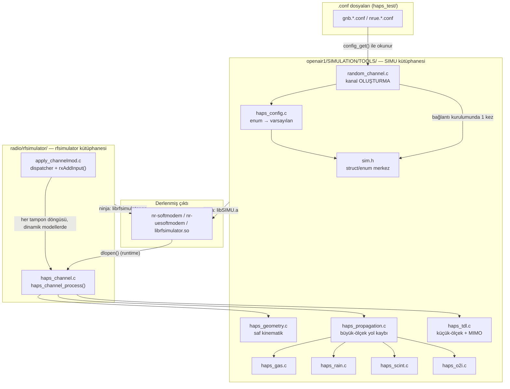

# HAPS Kanal Modeli — Dosya Haritası

Bu doküman, bu proje boyunca **dokunulan/oluşturulan tüm dosyaları**, aralarındaki ilişkiyi, ve her biri için **ne/neden/nasıl** sorularının cevabını tek bir yerde topluyor. `HAPS_MIMARI.md` sadece çekirdek fizik modüllerinin mimarisini anlatıyordu; bu doküman **build sistemi, test config'leri, Docker ve dokümantasyon dahil tüm proje ağacını** kapsıyor.

## 1. Büyük şematik

```
openairinterface5g/                              (ana OAI reposu, git: develop dalı)
│
├── openair1/SIMULATION/TOOLS/                    SIMU KÜTÜPHANESİ (genel, NR_MAC'a bağımlı değil)
│   ├── sim.h                                     ← struct/enum tanımları (HERKESİN bağımlı olduğu merkez)
│   ├── random_channel.c                          ← kanal OLUŞTURMA (case HAPS_STATIONARY*/HAPS_MOBILE*)
│   │        │                                       calls
│   │        ▼
│   ├── haps_config.c                             ← enum → varsayılan haps_ctx
│   ├── haps_geometry.c                           ← saf kinematik (NR bağımlılığı yok)
│   ├── haps_propagation.c ──┬─→ haps_gas.c        ← ITU-R P.676
│   │                        ├─→ haps_rain.c       ← ITU-R P.838-3
│   │                        ├─→ haps_scint.c      ← TR 38.811 §6.6.6.2
│   │                        └─→ haps_o2i.c        ← ITU-R P.2109
│   └── haps_tdl.c                                ← TR 38.811 §6.9.2 + MIMO korelasyonu
│
├── radio/rfsimulator/                            RFSIMULATOR KÜTÜPHANESİ (NR_MAC_gNB'ye bağımlı, SIB19 için)
│   ├── apply_channelmod.c                        ← dispatcher (is_haps_model?) + rxAddInput() (ORTAK, tüm modeller)
│   ├── haps_channel.h/.c                         ← haps_channel_process() (her tampon döngüsü orkestratörü)
│   └── CMakeLists.txt                            ← rfsimulator hedefi: simulator.cpp + apply_channelmod.c + haps_channel.c
│
├── CMakeLists.txt                                ← SIMUSRC listesi (her yeni haps_*.c burada da eklenir)
├── .dockerignore                                 ← .git/ hariç (Adım 34 - build context şişmesin diye)
│
└── haps_test/                                    NESTED REPO (ayrı git, dal: main)
    ├── gnb.haps.conf, nrue.haps.conf              ← Senaryo 1: HAPS_STATIONARY, band78
    ├── gnb.haps_mobile.conf, nrue.haps_mobile.conf ← Senaryo 2: HAPS_MOBILE, band78
    ├── gnb.haps_mobile_ntn.conf, nrue...           ← Senaryo 3: HAPS_MOBILE + gerçek NTN, band254
    ├── gnb.haps_mobile_ntn_38811.conf, nrue...      ← Senaryo 4: kırsal/banliyö
    ├── ..._urban.conf, ..._dense_urban.conf         ← Senaryo 5-6: kentsel varyantları
    ├── ..._2x2.conf, ..._2x1.conf                   ← Senaryo 7-8: MIMO
    ├── docker-compose.yaml                          ← resmi Docker (oai-gnb:latest/oai-nr-ue:latest, hâlâ test edilemedi)
    ├── Dockerfile.lite, docker-compose.lite.yml      ← hafif özel eşdeğer (Adım 34, gerçekten test edildi)
    ├── HAPS_GELISTIRME_GUNLUGU.md                    ← kronolojik günlük (35 Adım)
    ├── HAPS_MIMARI.md                                ← mimari referans (çekirdek fizik modülleri)
    ├── HAPS_CALISTIRMA_REHBERI.md                    ← çalıştırma rehberi (terminal komutları)
    └── HAPS_DOSYA_HARITASI.md                        ← bu doküman
```

## 2. Kod ilişkisi diyagramı



## 3. Dosya kataloğu — ne / neden / nasıl

### 3.1 Çekirdek fizik dosyaları (`openair1/SIMULATION/TOOLS/`)

| Dosya | Ne | Neden | Nasıl |
|---|---|---|---|
| `sim.h` | `channel_desc_t`, `haps_channel_ctx_t`, `SCM_t`, `haps_38811_scenario_t` tanımları | OAI'nin TÜM kanal modelleri (SCM/TDL/SAT_LEO/HAPS) bu header'ı paylaşıyor — minimum invaziflik için HAPS'a özel her şey **tek bir yeni alanla** (`haps_ctx`) eklendi, eski struct hiç bozulmadı | `haps_channel_ctx_t *haps_ctx` — HAPS-dışı modellerde hep `NULL` |
| `random_channel.c` | Kanal OLUŞTURMA mantığı (`case HAPS_STATIONARY*`/`HAPS_MOBILE*`) + kTB+NF gürültü formülü | Her `SCM_t` enum'unun ilk kurulumu (nb_taps, channel_length, ilk yol kaybı/gürültü) burada oluyor, bağlantı başına **bir kez** | `haps_config_new()` çağrılır; `HAPS_STATIONARY*` için yol kaybı/gürültü **burada tek seferlik** hesaplanır (çünkü hiçbir zaman dinamik güncellemeye girmiyor) |
| `haps_config.c` | Enum → `haps_channel_ctx_t` varsayılan atamaları | 8 enum'un (loiter_radius, use_38811_pathloss, scenario, enable_small_scale_fading) tek, merkezi tanımı | `SCM_t` değerine göre if/else zinciri |
| `haps_geometry.c` | Loiter-dairesi kinematiği (pozisyon/hız, t'nin fonksiyonu) | Platformun zamanla nasıl hareket ettiğini hesaplayan saf matematik, hiçbir NR/OAI bağımlılığı olmadan bağımsız test edilebilsin diye ayrı dosya | Girdi: yarıçap/hız/irtifa/t; çıktı: pozisyon/hız vektörleri |
| `haps_propagation.c` | TR 38.811 büyük-ölçekli yol kaybı (FSPL+SF+CL) | Adım 15/17'de "keyfi `ploss_dB=20` yerine gerçek fizik" istendiğinde eklendi | LOS/NLOS olasılıksal çekim + gölgeleme + saçaklanma, gas/rain/scint/o2i toplamı |
| `haps_gas.c` | Atmosferik gaz kaybı | Spec'in kendi "gaz kaybı de eklenmeli" notu (Adım 18) | ITU-R P.676 Ek 2 formülü, ITU-Rpy'den port |
| `haps_rain.c` | Yağmur kaybı | 38.811'in kendi kapsamı dışında ama slant-path modelinin doğal bir parçası (Adım 18) | ITU-R P.838-3, opt-in (`HAPS_RAIN_RATE_MM_H`) |
| `haps_scint.c` | Troposferik sintilasyon | Adım 22'de istendi, dar bir Ka-bant yer tutucu olarak sınırlı tutuldu | Tablo 6.6.6.2.1-1, sadece >6GHz |
| `haps_o2i.c` | O2I bina girişi kaybı | Kalan son "kasıtlı kapsam dışı" madde, Adım 28'de eklendi | ITU-R P.2109, opt-in (`HAPS_O2I_ENABLE`) |
| `haps_tdl.c` | Küçük-ölçekli sönümleme (NTN-TDL-A/B/C/D) + MIMO uzamsal korelasyonu + `fd_local` | Adım 21 (TDL-A/C) → 30 (B/D) → 31 (2x2) → 32 (Ka-bant DS) → 33 (`fd_local`) → 35 (2x1/1x2) aşamalı eklendi | AR(1) süreç + korelasyon matrisi (`R_sqrt`) |

### 3.2 rfsimulator entegrasyonu (`radio/rfsimulator/`)

| Dosya | Ne | Neden | Nasıl |
|---|---|---|---|
| `haps_channel.h/.c` | `haps_channel_process()` — her tampon döngüsü orkestratörü | Adım 26'da partnerin dosya-başına-modül şemasına tam uyum için ayrıldı; `nr_update_sib19()` çağırdığı için `SIMU` kütüphanesi yerine burada yaşıyor | Geometri → gecikme/Doppler → fraksiyonel gecikme/TDL tap'ları → yol kaybı → SIB19 güncellemesi sırayla çağrılır |
| `apply_channelmod.c` | Dispatcher (`is_haps_model()`) + `rxAddInput()` (FIR konvolüsyonu) | `rxAddInput()` TÜM modellerin (HAPS dahil) ortak yolu — HAPS'a özel hiçbir şey içermiyor, sadece `channel_desc_t.ch[]`'yi uyguluyor | HAPS ise `haps_channel_process()`'e yönlendirir, değilse (SAT_LEO_TRANS/REGEN) eski/değişmemiş yola devam eder |
| `CMakeLists.txt` (rfsimulator) | Build hedefi tanımı | Yeni `haps_channel.c` dosyasının derleme grafiğine eklenmesi gerekiyordu | `add_library(rfsimulator MODULE simulator.cpp apply_channelmod.c haps_channel.c ...)` |

### 3.3 Build sistemi

| Dosya | Ne | Neden | Nasıl |
|---|---|---|---|
| `CMakeLists.txt` (kök) | `SIMUSRC` listesi | Her yeni `haps_*.c` dosyası oluşturulduğunda burada da eklenmesi gerekiyor, yoksa derlenmez | Dosya yolu listeye eklenir |
| `.dockerignore` | Docker build context filtreleme | `.git/` (498MB) hariç tutulmamıştı — hem context transferini hem konteyner içi `COPY . .`'yi gereksiz şişiriyordu (Adım 34) | `.git/` satırı eklendi |

### 3.4 Test config'leri (`haps_test/`)

| Dosya çifti | Senaryo | Neden oluşturuldu |
|---|---|---|
| `gnb.haps.conf` / `nrue.haps.conf` | `HAPS_STATIONARY`, band78 | Projenin İLK, en temel kanıtlanmış senaryosu (Adım 1-7) |
| `gnb.haps_mobile.conf` / `nrue.haps_mobile.conf` | `HAPS_MOBILE`, band78 | Hareketli platform testi; PRACH format sorunu (Adım 24) ve TA/SRS sorunu (Adım 25) burada bulunup çözüldü |
| `gnb.haps_mobile_ntn.conf` / `nrue.haps_mobile_ntn.conf` | `HAPS_MOBILE` + gerçek NTN/SIB19, band254 | Adım 9-13: gerçek NTN protokolü/Doppler/SIB19 devreye alındığında |
| `gnb.haps_mobile_ntn_38811.conf` / `nrue...` | `HAPS_MOBILE_38811`, kırsal/banliyö | Adım 15: gerçek TR 38.811 fiziği ilk kez test edildiğinde |
| `..._urban.conf` / `..._dense_urban.conf` | Kentsel/yoğun kentsel varyantları | Adım 17: senaryo genişletmesi |
| `..._2x2.conf` | MIMO 2x2 | Adım 31: gerçek MIMO testi için |
| `..._2x1.conf` | SIMO/MISO 2x1 | Adım 35: kod testi (RRC'ye ulaşmıyor, bilinen OAI sınırı) |

### 3.5 Docker

| Dosya | Ne | Neden | Nasıl |
|---|---|---|---|
| `docker-compose.yaml` | Resmi Docker Compose tanımı (oai-amf/oai-gnb/oai-nr-ue) | Projenin orijinal Docker dağıtım dosyası, Adım 2/23'te düzeltildi | Hâlâ gerçek `docker compose up` ile test edilemedi — resmi imaj zinciri (~9.2GB) bu makinenin diskine sığmıyor |
| `Dockerfile.lite` / `docker-compose.lite.yml` | Hafif özel Docker eşdeğeri | Adım 34: gerçek bir Docker doğrulaması yapabilmek için, resmi zincir yerine zaten derlenmiş binary'leri (169MB) kullanan bir alternatif | `RRCSetupComplete` ile gerçekten doğrulandı |

### 3.6 Dokümantasyon

| Dosya | Ne için |
|---|---|
| `HAPS_GELISTIRME_GUNLUGU.md` | Kronolojik günlük — "hangi sırayla, hangi testle, hangi sonuçla" (35 Adım) |
| `HAPS_MIMARI.md` | Mimari referans — "şu an sistem nasıl çalışıyor" (çekirdek fizik modülleri + veri akışı + referans tablosu) |
| `HAPS_CALISTIRMA_REHBERI.md` | Çalıştırma rehberi — "terminale ne yazacağım" |
| `HAPS_DOSYA_HARITASI.md` | Bu doküman — "hangi dosya neden var, birbirleriyle ilişkisi ne" |
